### Apache Maven 介绍
- **定义**：Apache Maven 是一个项目管理和构建工具，它基于项目对象模型（POM, Project Object Model）的概念，通过一小段描述信息来管理项目的构建。

- **作用**：
    - 方便的依赖管理
    - 标准的项目构建流程
    - 统一的项目结构

- **官网**：[http://maven.apache.org/](http://maven.apache.org/)
- **Maven核心工作原理架构**：
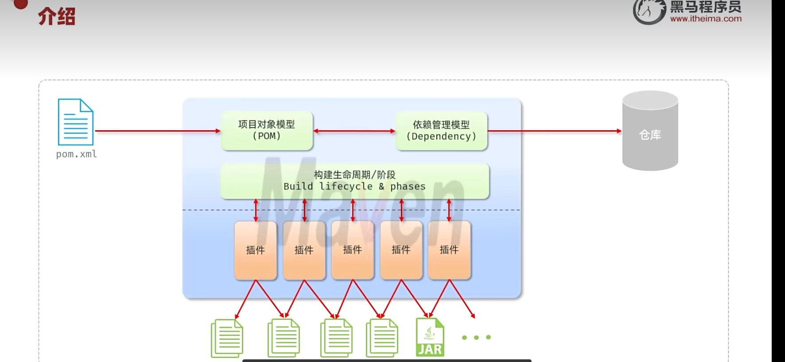
# 🔍 核心流程拆解
1.起点：pom.xml
这是 Maven 项目的核心配置文件，所有规则、依赖、构建逻辑都写在这里，是整个流程的 “指挥中心”。

2.两大核心模型：
- 项目对象模型（POM）：解析 pom.xml 里的项目基本信息（项目坐标、版本、打包方式等）。
- 依赖管理模型（Dependency）：解析 pom.xml 里的依赖配置，自动去仓库（本地 / 远程 / 私服）下载对应的 Jar 包，并处理依赖传递、冲突解决。

3.构建生命周期 / 阶段（Build Lifecycle & Phases）：
Maven 定义了一套标准的构建流程（比如 clean、compile、test、package、install、deploy），每个阶段都是构建过程的一个步骤，按顺序执行。

4.插件（Plugins）：
构建生命周期的每个阶段，都由对应的 Maven 插件来完成具体的工作。比如：
- compile 阶段由 maven-compiler-plugin 编译 Java 代码
- package 阶段由 maven-jar-plugin 打包成 Jar 包
```
插件是 Maven 的 “执行者”，生命周期是 “流程大纲”。
```

5.最终输出：
插件执行完成后，会生成项目的构建产物，比如 .class 字节码文件、.jar 包、.war 包等。

- **Maven坐标**：
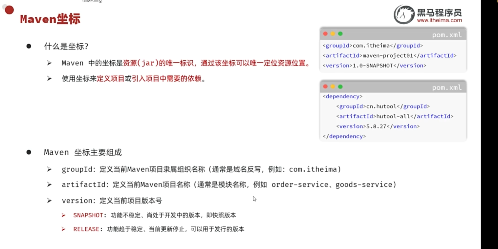
- **导入模块**:
    - 点击顶部菜单栏「File」→「Project Structure」。
    - 左侧选择「Modules」，点击左上角的 + 号 → 选择「Import Module」。
    - 找到子模块的pom.xml文件，选中后点击「OK」,完成即可。
- **依赖配置**：
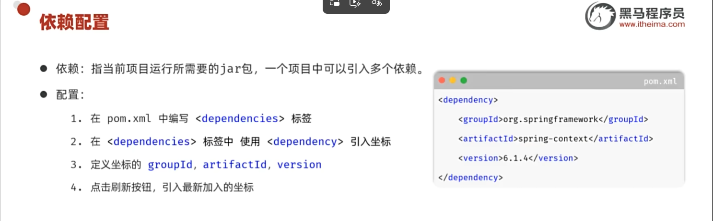
- **排除依赖**：
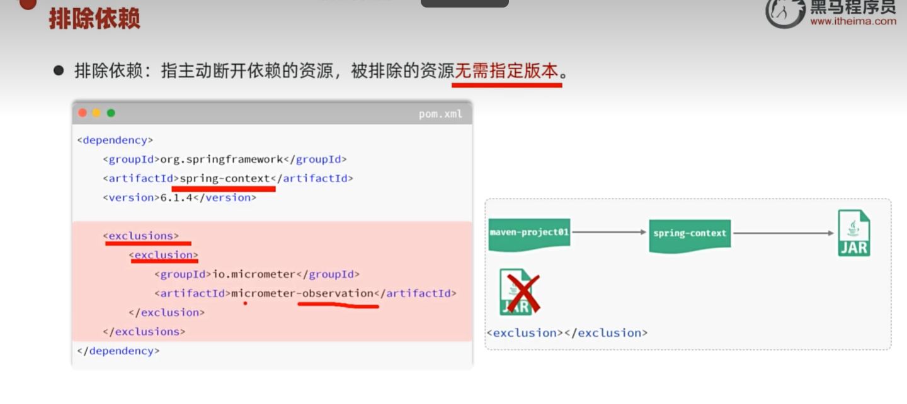
- **生命周期**：
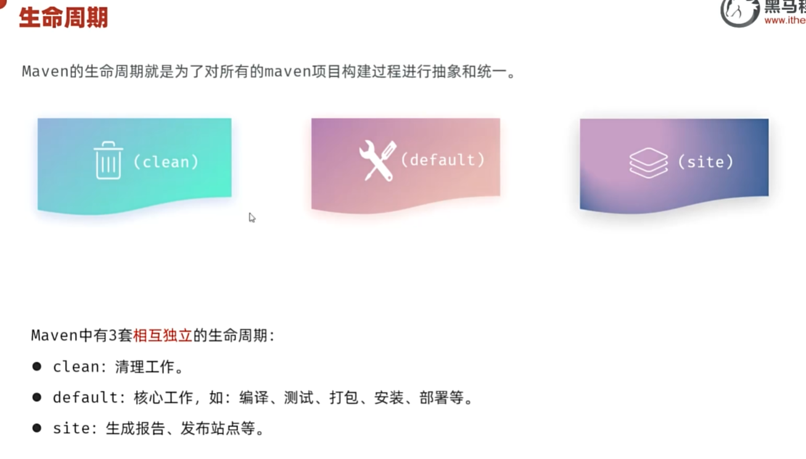
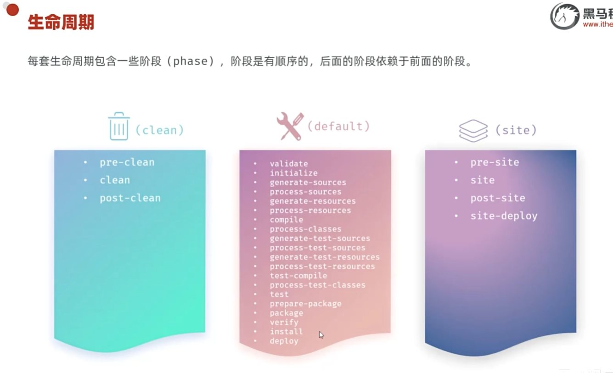
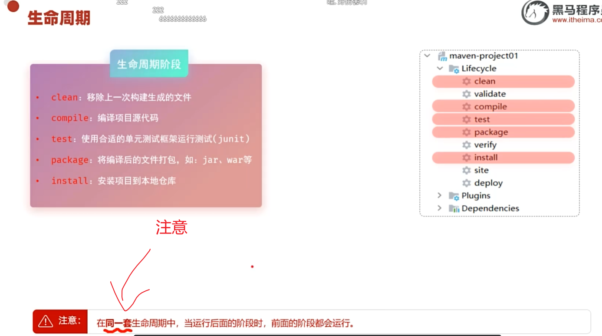
### Maven 执行指定生命周期的两种方式
1. **在 IDEA 中执行**
   在 IDEA 右侧的 Maven 工具栏中，选中对应的生命周期目标，双击即可执行。

2. **在命令行中执行**
   直接在终端/命令提示符中输入对应的 Maven 命令执行，例如：
   ```bash
   # 编译项目
   mvn compile
   
   # 清理项目
   mvn clean
   
   # 打包项目
   mvn package
   
   # 安装到本地仓库
   mvn install
# 🔍测试
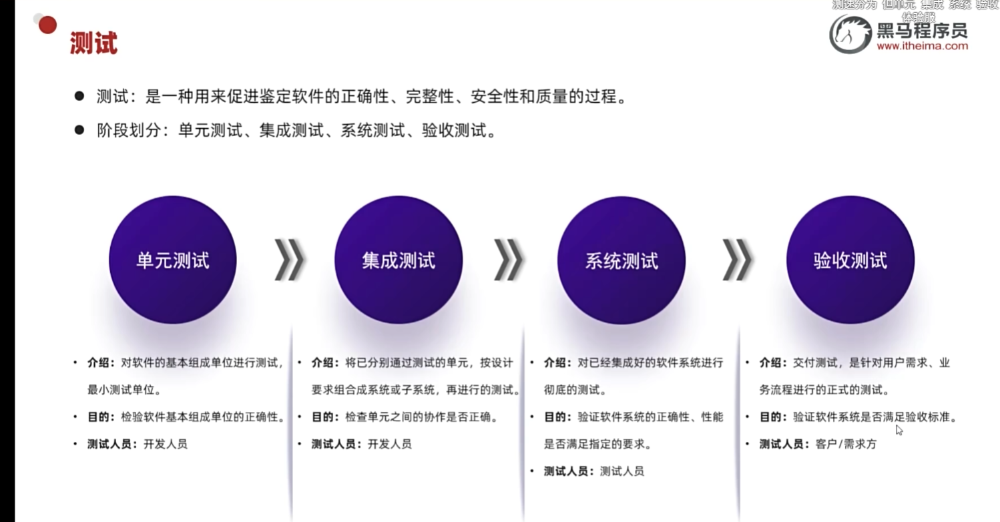
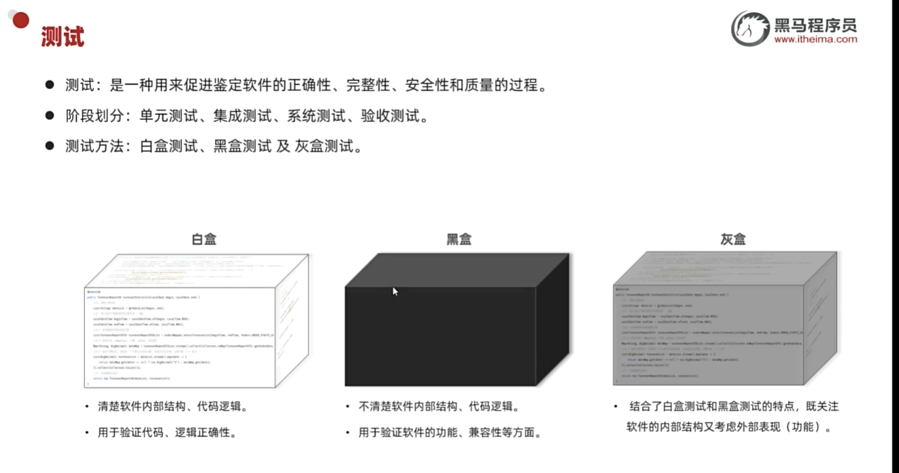**单元测试**：
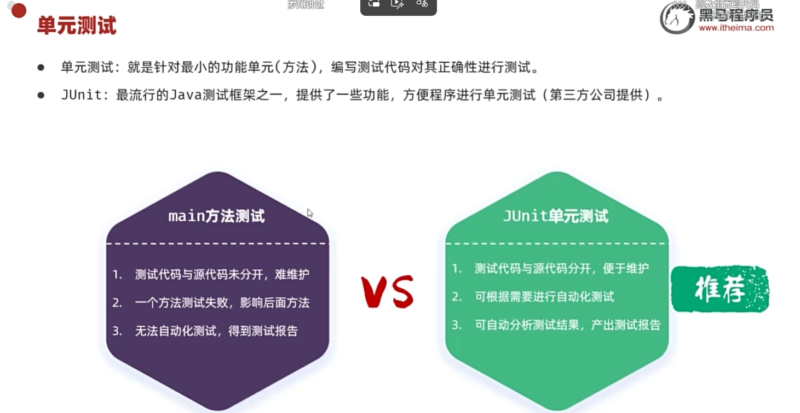
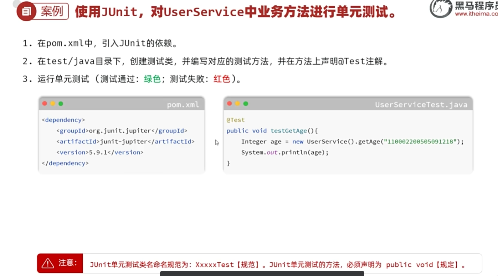
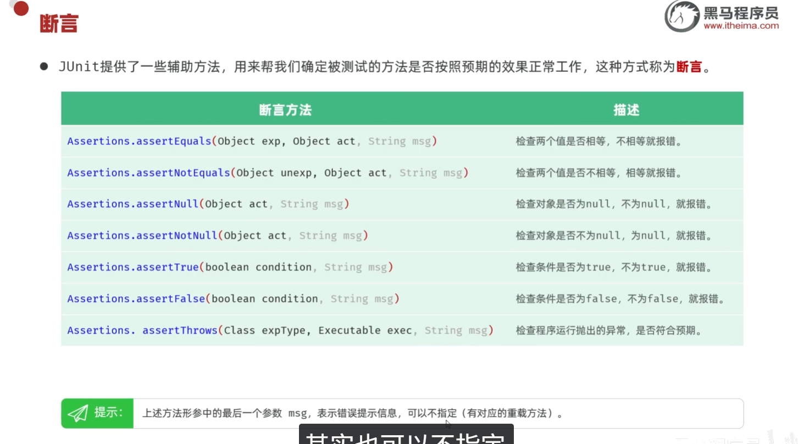
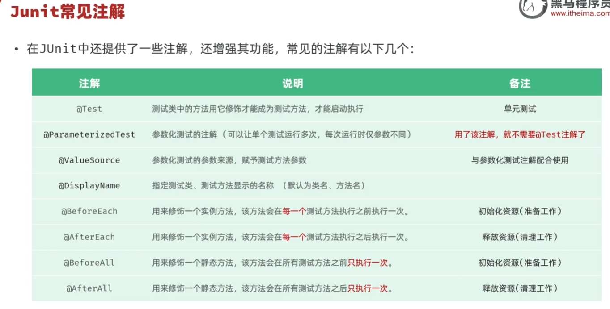

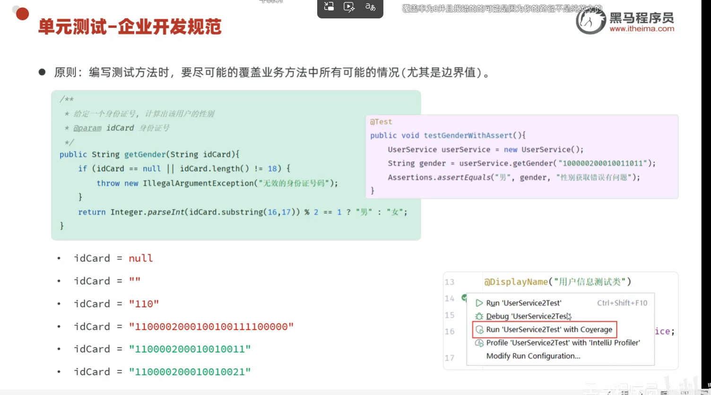
# 🔍依赖范围
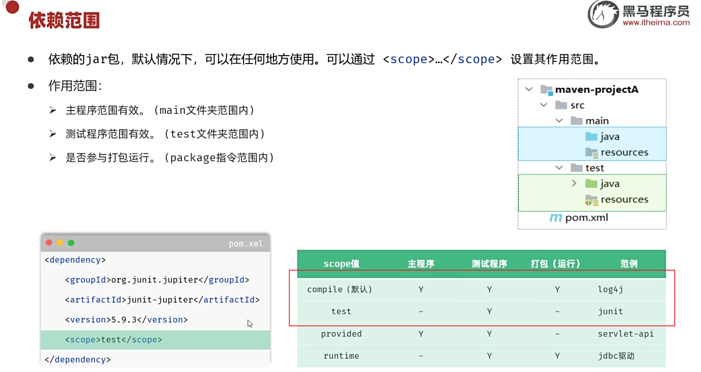
# 🔍依赖下载报错解决方式
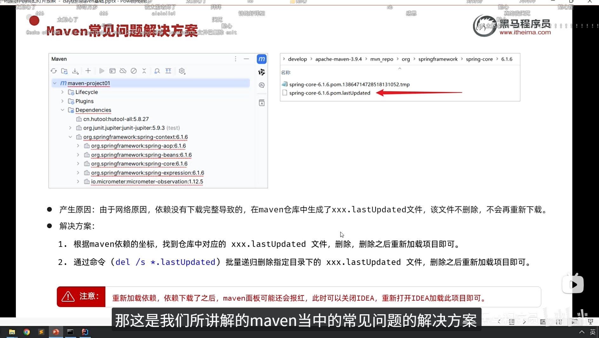