# Web 标准笔记

---

## 一、Web 标准概述
- **定义**：Web 标准也称网页标准，由一系列的标准组成，大部分由 **W3C（万维网联盟，World Wide Web Consortium）** 负责制定。
- **核心目的**：确保网页在不同浏览器、设备上的一致性表现，实现结构、表现、行为的分离。

---

## 二、Web 标准三大组成部分

| 技术 | 核心职责 | 作用说明 |
| :--- | :--- | :--- |
| **HTML** | **结构** | 定义网页的骨架与内容，如标题、段落、图片、列表、表单等元素，决定“页面里有什么”。 |
| **CSS** | **表现** | 控制网页元素的外观与布局，如颜色、大小、边距、定位、响应式适配等，决定“页面长什么样”。 |
| **JavaScript** | **行为** | 实现网页的交互与动态效果，如按钮点击、表单验证、数据请求、动画渲染等，决定“页面能做什么”。 |

---

## 三、核心要点总结
- **分离思想**：结构、表现、行为三者分离，是 Web 标准的核心原则，便于代码维护、复用与升级。
- **兼容性**：遵循标准编写的网页，能在 Chrome、Firefox、Edge 等主流浏览器中保持一致的显示效果。
- **可维护性**：HTML 负责内容、CSS 负责样式、JS 负责交互，职责清晰，后续修改和扩展更高效。

---

💡 一句话记忆：**HTML 搭骨架，CSS 穿衣服，JavaScript 做动作。**

# 什么是 HTML 笔记

---

## 一、HTML 定义
- **全称**：HTML（HyperText Markup Language），超文本标记语言。

---

## 二、两大核心概念
### 1. 超文本（HyperText）
- 超越了普通文本的限制，除了文字信息外，还可以定义**图片、音频、视频**等多媒体内容。

### 2. 标记语言（Markup Language）
- 由预定义的标签（`<标签名>`）构成的语言。
- 标签示例：
    - `<h1>`：展示标题
    - ``：展示图片
    - `<video>`：展示视频
- 运行方式：HTML 代码直接在浏览器中运行，由浏览器解析标签并渲染内容。

---

## 三、HTML 标签结构
以入门程序为例：
```html
<h1>HTML入门程序</h1>

```

# 什么是 CSS 笔记

---

## 一、CSS 定义
- **全称**：CSS（Cascading Style Sheet），层叠样式表。
- **作用**：用于控制页面的**样式（表现）**，比如颜色、大小、布局、间距、动画等外观效果。

---

## 二、核心理解
- 与 HTML 配合使用：HTML 负责页面的**结构和内容**，CSS 负责页面的**外观和表现**，二者分离，便于维护。
- “层叠”的含义：多个样式规则可以叠加作用于同一个元素，当规则冲突时，会按照优先级（选择器权重、就近原则等）来决定最终生效的样式。
- CSS引入方式:
  - 行内样式: 写在标签的style属性中（配合JavaScript使用）
  - 内部样式: 写在style标签中（可以写在页面任何位置，但通常约定写在head标签中）
  - 外部样式: 写在一个单独的.css文件中（需要通过 link 标签在网页中引入）
- 颜色表示形式：

| 表示方式 | 属性值 | 说明 | 示例 |
| --- | --- | --- | --- |
| 关键字 | 颜色英文单词 | red、green、blue | red、green、blue... |
| rgb表示法 | rgb(r,g,b) | 红绿蓝三原色，取值：0-255 | rgb(0,0,0)、rgb(255,0,0) |
| rgba表示法 | rgba(r,g,b,a) | 红绿蓝三原色，a表示透明度，取值：0-1 | rgba(0,0,0,0.3)、rgba(255,0,0,0.5) |
| 十六进制表示法 | #rrggbb | #开头，将数字转换成十六进制表示 | #000000、#ff0000，简写：#000、#f00 |
- CSS选择器是用来选取需要设置样式的元素（标签）的。

| 选择器 | 写法 | 示例 | 示例说明 |
| --- | --- | --- | --- |
| 元素选择器 | 元素名称 {...} | h1 {...} | 选择页面上所有的`<h1>`标签 |
| 类选择器 | .class属性值 {...} | .cls {...} | 选择页面上所有class属性为cls的标签 |
| id选择器 | #id属性值 {...} | #hid {...} | 选择页面上id属性为hid的标签 |
| 分组选择器 | 选择器1,选择器2 {...} | h1,h2 {...} | 选择页面上所有的`<h1>`和`<h2>`标签 |
| 属性选择器 | 元素名称[属性] {...} | input[type] {...} | 选择页面上有type属性的`<input>`标签 |
| 属性选择器 | 元素名称[属性名="值"] {...} | input[type="text"] {...} | 选择页面上type属性为text的`<input>`标签 |
| 后代选择器 | 元素1 元素2 {...} | form input {...} | 选择<form>标签内的所有`<input>`标签 |
---
匹配结果相同时选取顺序:id选择器>类选择器>元素选择器;       
这三种是常见选择器

💡 一句话理解：HTML 是网页的骨架，CSS 就是给骨架“化妆”，让网页变得美观、排版整齐。

### HTML 标签与资源路径笔记

| 标签 | 作用 | 属性/说明 |
| --- | --- | --- |
| &lt;video&gt; | 视频标签 | src：指定视频的url（绝对路径/相对路径）<br>controls：是否显示播放控件<br>width：宽度（像素/相对于父元素百分比）<br>height：高度（像素/相对于父元素百分比） |
| &lt;img&gt; | 图片标签 | src, width, height |
| &lt;p&gt; | 段落标签 | - |

---

### 资源路径写法
- **绝对路径**
  - 绝对磁盘路径（`D:/xxx.jpg`）
  - 绝对网络路径（`https://xxx.jpg`）
- **相对路径**
  - 当前目录：`./`（可以省略）
  - 上一级目录：`../` 

### HTML 文本格式化标签
| 标签 | 作用 | 属性/说明 |
| --- | --- | --- |
| &lt;b&gt; / &lt;strong&gt; | 加粗 | &lt;strong&gt; 具有强调语义 |
| &lt;u&gt; / &lt;ins&gt; | 下划线 | &lt;ins&gt; 具有强调语义 |
| &lt;i&gt; / &lt;em&gt; | 倾斜 | &lt;em&gt; 具有强调语义 |
| &lt;s&gt; / &lt;del&gt; | 删除线 | &lt;del&gt; 具有强调语义 |

---

### HTML 字符实体
| 字符实体 | 属性/说明 |
| --- | --- |
| &amp;nbsp; | 空格 |
| &amp;lt; | &lt; |
| &amp;gt; | &gt; |

---

### CSS 属性
- `line-height`: 设置行高
- `text-indent`: 首行缩进 

### 盒子模型
- 盒子：页面中所有的元素（标签），都可以看做是一个 **盒子**，由盒子将页面中的元素包含在一个矩形区域内，通过盒子的视角更方便的进行页面布局
- 盒子模型组成：**内容区域（content）、内边距区域（padding）、边框区域（border）、外边距区域（margin）**
### 布局标签与盒子模型笔记

#### 1. 布局标签
网页开发中，会使用 `div` 和 `span` 这两个没有语义的布局标签。

| 标签 | 特点 |
| --- | --- |
| `<div>` | 一行只显示一个（独占一行）<br>宽度默认是父元素的宽度，高度默认由内容撑开<br>可以设置宽高（width、height） |
| `<span>` | 一行可以显示多个<br>宽度和高度默认由内容撑开<br>不可以设置宽高（width、height） |

---

#### 2. 盒子模型示意
- 结构：`margin`（外边距）→ `border`（边框）→ `padding`（内边距）→ `content`（内容）
- 方向：上、右、下、左

---

#### 3. 盒子模型属性写法示例
```css
/* 写法1：分别设置四个方向（上 右 下 左） */
div {
  width: 200px;
  height: 100px;
  background-color: #05a5d2;
  padding: 20px 20px 20px 20px;
  border: 20px solid #6bd5d7;
  margin: 30px 30px 30px 30px;
}

/* 写法2：上下 左右 */
div {
  width: 200px;
  height: 100px;
  background-color: #05a5d2;
  padding: 20px 20px;
  border: 20px solid #6bd5d7;
  margin: 30px 30px;
}

/* 写法3：四个方向相同，简写 */
div {
  width: 200px;
  height: 100px;
  background-color: #05a5d2;
  padding: 20px;
  border: 20px solid #6bd5d7;
  margin: 30px;
}
```
### flex布局
- flex是flexible Box的缩写，意为"弹性布局"，是一种一维的布局模型。flex布局可以为元素之间提供强大的空间分布和对齐能力。
- 通过给父容器添加flex的相关属性，来控制子元素的位置和排列方式。

| 属性 | 取值 | 含义 |
| --- | --- | --- |
| display | flex | 使用flex布局 |
| flex-direction（设置主轴） | row | 主轴方向为x轴，水平向右。（默认） |
| | column | 主轴方向为y轴，垂直向下。 |
| justify-content（子元素在主轴上的对齐方式） | flex-start | 从头开始排列 |
| | flex-end | 从尾部开始排列 |
| | center | 在主轴居中对齐 |
| | space-around | 平分剩余空间 |
| | space-between | 先两边贴边，再平分剩余空间 |
### 表单标签
- 表单：在网页中主要负责数据采集功能，如 注册、登录等数据采集。
- 标签： `<form>`
- 表单项：不同类型的 `input` 元素、下拉列表、文本域等。
  - `<input>`：定义表单项，通过`type`属性控制输入形式（`text`/`password`/...）
  - `<select>`：定义下拉列表
  - `<textarea>`：定义文本域
- 属性：
  - `action`：规定当提交表单时向何处发送表单数据，URL
  - `method`：规定用于发送表单数据的方式。`GET`、`POST`
### 表单标签-表单项
- `<input>`：表单项，通过`type`属性控制输入形式。
- `<select>`：定义下拉列表，`<option>` 定义列表项。
- `<textarea>`：文本域
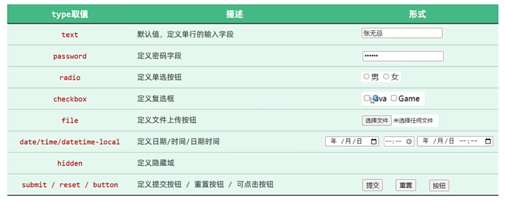
- ### 表格标签

| 标签 | 描述 |
| --- | --- |
| &lt;table&gt; | 定义表格整体 |
| &lt;thead&gt; | 用于定义表格头部（可选） |
| &lt;tbody&gt; | 定义表格中的主体部分（可选） |
| &lt;tr&gt; | 表格的行，可以包裹多个 &lt;td&gt; |
| &lt;td&gt; | 表格单元格（普通），可以包裹内容；如果是表头单元格，可以替换为 &lt;th&gt; |
### 什么是JavaScript
- JavaScript（简称：JS）是一门跨平台、面向对象的脚本语言，是用来控制网页行为，实现页面的交互效果。JavaScript 和 Java 是完全不同的语言，不论是概念还是设计。但是基础语法类似。

#### 组成：
- **ECMAScript**：规定了JS基础语法核心知识，包括变量、数据类型、流程控制、函数、对象等。
- **BOM**：浏览器对象模型，用于操作浏览器本身，如：页面弹窗、地址栏操作、关闭窗口等。
- **DOM**：文档对象模型，用于操作HTML文档，如：改变标签内的内容、改变标签内字体样式等。

> **补充说明**：ECMA国际（前身为欧洲计算机制造商协会），制定了标准化的脚本程序设计语言 ECMAScript，这种语言得到广泛应用。而JavaScript是遵守ECMAScript的标准的（ES2024是最新版本）。

 ### JS引入方式

- **内部脚本**：将JS代码定义在HTML页面中
  - JavaScript代码必须位于 `<script></script>` 标签之间
  - 在HTML文档中，可以在任意地方，放置任意数量的 `<script>`
  - 一般会把脚本置于 `<body>` 元素的底部，可改善显示速度

- **外部脚本**：将 JS 代码定义在外部 JS 文件中，然后引入到HTML页面中
- **书写规范**: 每行结尾以分号结尾，结尾分号可有可无
### 变量 & 常量
- JS中用 `let` 关键字来声明变量（弱类型语言，变量可以存放不同类型的值）。
- 变量名需要遵循如下规则：
  - 只能用字母、数字、下划线（`_`）、美元符号（`$`）组成，且数字不能开头
  - 变量名严格区分大小写，如 `name` 和 `Name` 是不同的变量
  - 不能使用关键字，如：`let`、`var`、`if`、`for` 等
- JS中用 `const` 关键字来声明常量。
- 一旦声明，常量的值就不能改变（不可以重新赋值）。

### 数据类型
- JavaScript的数据类型分为：**基本数据类型**和**引用数据类型（对象）**。

#### 基本数据类型：
- `number`：数字（整数、小数、`NaN`(Not a Number)）
- `boolean`：布尔值，`true` / `false`
- `null`：对象为空。JavaScript是大小写敏感的，因此`null`、`Null`、`NULL`是完全不同的
- `undefined`：当声明的变量未初始化时，该变量的默认值是 `undefined`
- `string`：字符串，单引号、双引号、反引号皆可，推荐使用单引号

- 使用 `typeof` 运算符可以获取数据类型。
### 函数
- 介绍：函数（`function`）是被设计用来执行特定任务的代码块，方便程序的封装复用。

- 定义：JavaScript中的函数通过`function`关键字进行定义，语法为：
-   function functionName(参数1, 参数2 ...){
    //要执行的代码
    }
- 由于 JS 是弱类型语言，形参、返回值都不需要指定类型。在调用函数时，实参个数与形参个数可以不一致，但是建议一致。
  ```javascript
  //创建函数
  function add(a, b){
    return a + b;
  }
  //调用函数
  let result = add(10,20);
  alert(result);
  ```
  ### 匿名函数
- 匿名函数是指一种没有名称的函数，可以通过两种方式定义：**函数表达式** 和 **箭头函数**。

#### 1. 定义方式
- **函数表达式**：
```javascript
let add = function(a, b){
    return a + b;
}
```
- **箭头表达式**：
```javascript
let add = (a, b) => {
    return a + b;
}
```
- **调用方式**：
```javascript
let result = add(10,20);
alert(result);
```
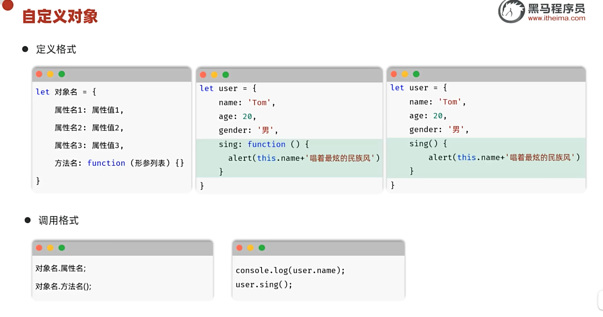
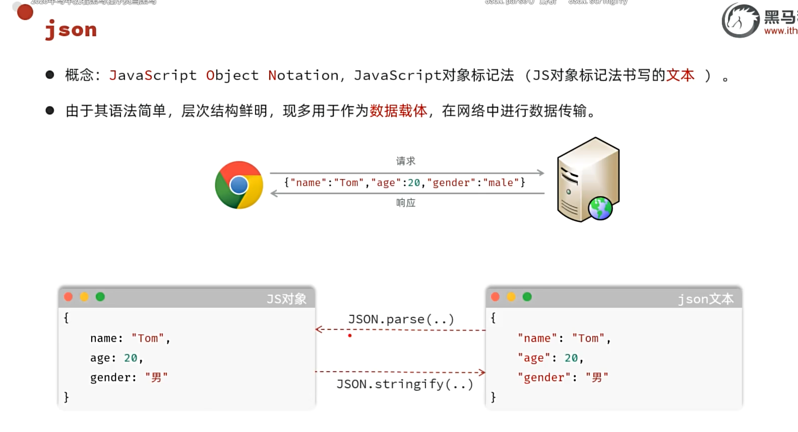
### JSON 相关知识点

#### 1. JSON 格式特点
- JSON 格式的文本所有的 `key` 必须使用**双引号**引起来。

---

#### 2. JSON 对象的两个方法
- `JSON.parse()`：将 JSON 字符串转为 JS 对象。
- `JSON.stringify()`：将 JS 对象转为 JSON 字符串。
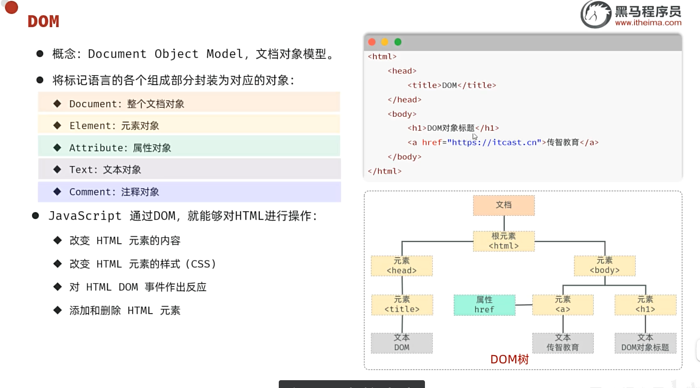
### DOM操作

- **DOM操作核心思想**：将网页中所有的元素当做对象来处理（标签的所有属性在该对象上都可以找到）。

- **操作步骤**：
  1. 获取要操作的DOM元素对象
  2. 操作DOM对象的属性或方法（查文档或AI）

- **获取DOM对象**：
  - 根据CSS选择器获取匹配到的**第一个元素**：
    `document.querySelector('选择器')`
    示例：`#sid`、`.txt`、`span`
  - 根据CSS选择器获取匹配到的**所有元素**：
    `document.querySelectorAll('选择器')`
    > 注意：得到的是一个`NodeList`节点集合，是一个伪数组（有长度、有索引的数组）。
### 什么是事件？什么是事件监听？

- **事件**：HTML事件是发生在HTML元素上的 "事情"。
  例如：
  - 按钮被点击
  - 鼠标移动到元素上
  - 按下键盘按键

- **事件监听**：JavaScript可以在事件触发时，立即调用一个函数做出响应，也称为 **事件绑定** 或 **注册事件**。
### 事件监听
- **语法**： 事件源.addEventListener('事件类型', 事件触发执行的函数);
- 事件源：哪个 DOM 元素触发了事件，需要先获取该 DOM 元素
- 事件类型：用什么方式触发，比如鼠标单击 click
- 事件触发执行的函数：事件发生时要执行的操作（要做什么事）
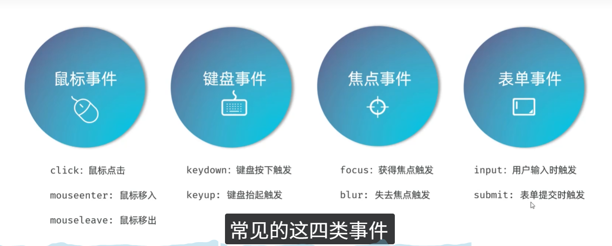
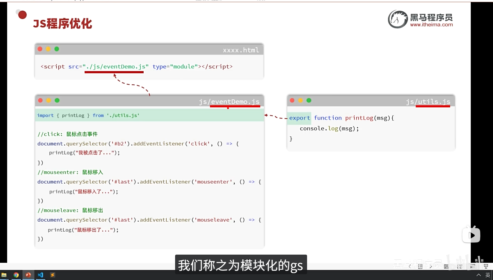
- 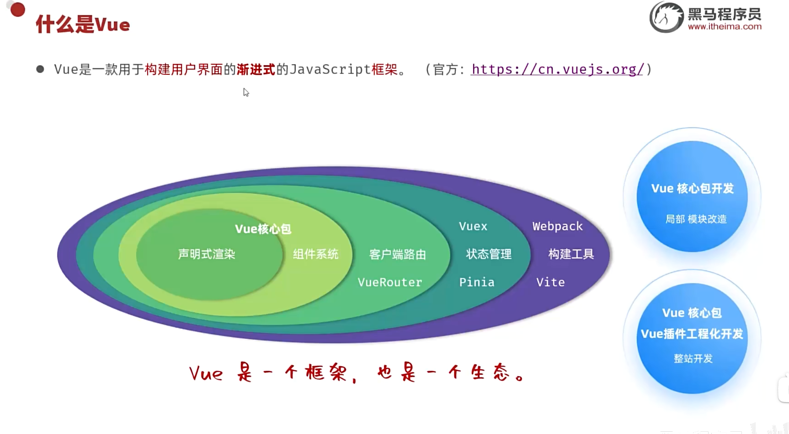
- 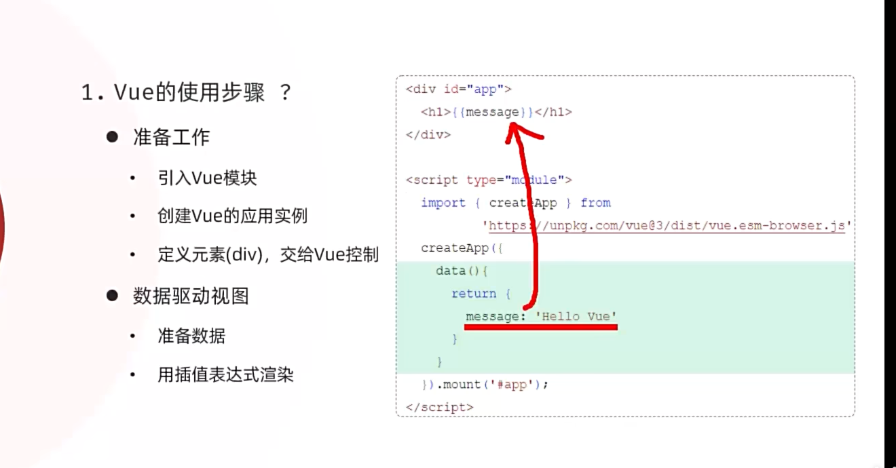
- ### 常用指令
- 指令：HTML标签上带有 `v-` 前缀的特殊属性，不同的指令具有不同的含义，可以实现不同的功能。

| 指令 | 作用 |
| --- | --- |
| `v-for` | 列表渲染，遍历容器的元素或者对象的属性 |
| `v-bind` | 为HTML标签绑定属性值，如设置 `href`，CSS样式等 |
| `v-if`/`v-else-if`/`v-else` | 条件性的渲染某元素，判定为true时渲染，否则不渲染 |
| `v-show` | 根据条件展示某元素，区别在于切换的是`display`属性的值 |
| `v-model` | 在表单元素上创建双向数据绑定 |
| `v-on` | 为HTML标签绑定事件 |
### `v-for`
- **作用**：列表渲染，遍历容器的元素或者对象的属性
- **语法**：
  ```html
  <tr v-for="(item, index) in items" :key="item.id"> {{item}} </tr>
  ```
- **参数说明**：
  - items：为遍历的数组
  - item：为遍历出来的元素
  - index：为索引 / 下标，从 0 开始；可以省略，省略 index 的语法：v-for="item in items"
- **key**：
  - 作用：给元素添加的唯一标识，便于 Vue 进行列表项的正确排序复用，提升渲染性能
  - 推荐使用id作为 key（唯一），不推荐使用index作为 key（会变化，不对应）
---
    注意：
    遍历的数组，必须在data中定义
    要想让哪个标签循环展示多次，就在哪个标签上使用v-for指令
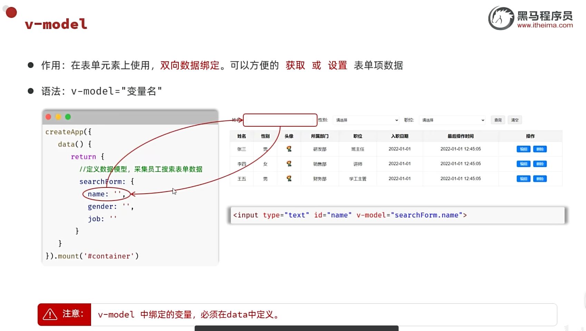
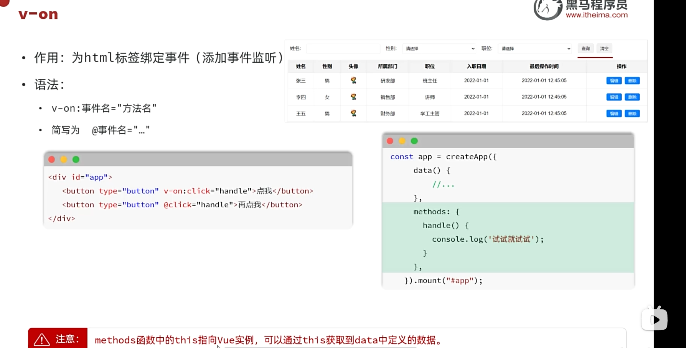
---
    注意:
    方法要定义在与data同级的method里
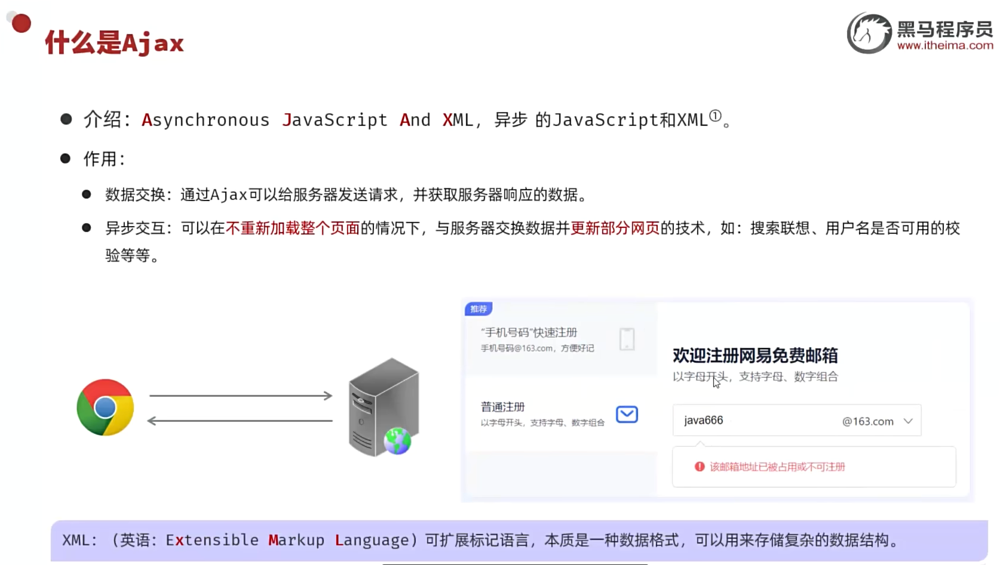
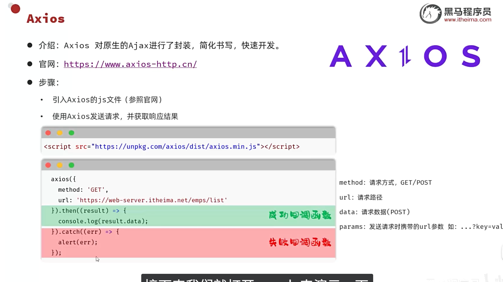
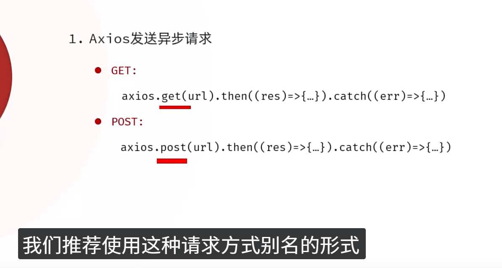
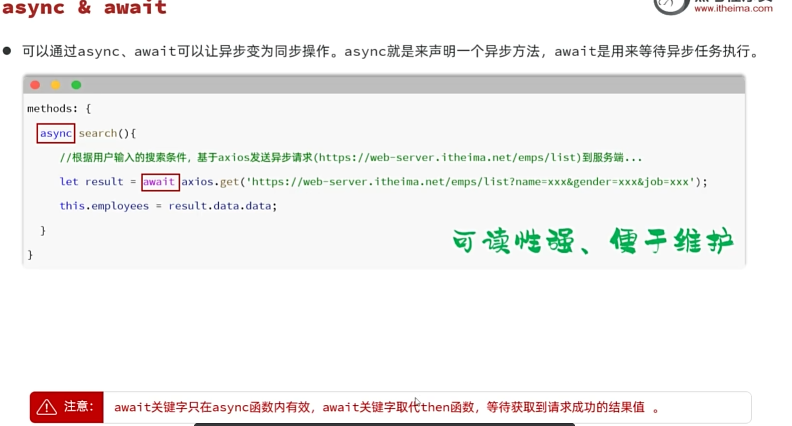
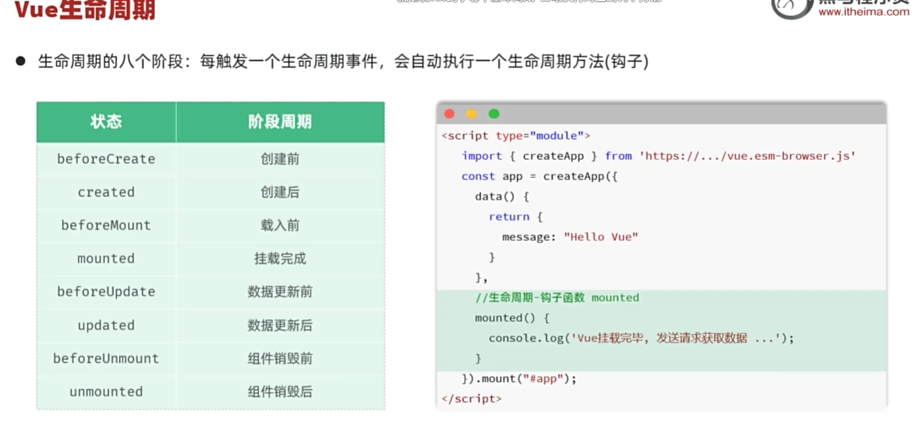


  